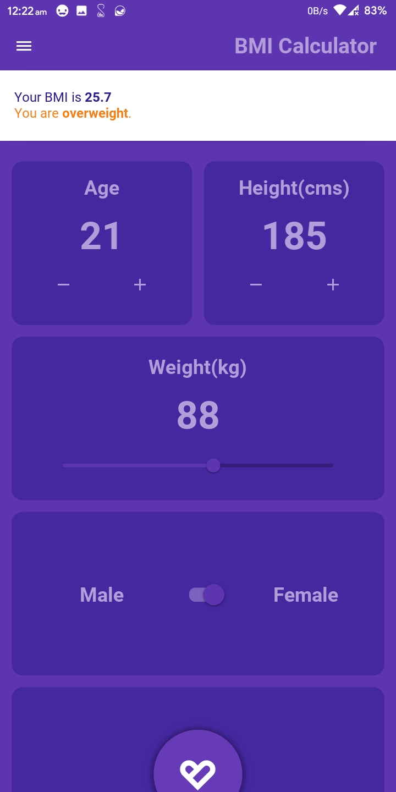

#  Kivy BMI Calculator App


This app is a cross-platform BMI Calculator which is completely developed using Python3 and kivy framework.
KivyMD widgets were also used.


## List of Contents

1. [Features](#features)
2. [Demo](#demo)
3. [Dependencies](#dependencies)
4. [Usage](#usage)
5. [Development](#development)
6. [License](#license)
7. [Contributors](#contributors)


## Features

- Multiple Themes supported (including Dark and Deep Purple themes)
- Calculate BMI and also display Alert based on your BMI
- Fully scalable and therfore can be used on multiple devices.
- Subtle Animations with Flare
- Toast/Snackbar supported buttons
- Minimal design with smooth transitions
- Optimised storage using minimal packages
- Application size under 15 MB


## Demo

|  |  |  |
| :-------------: | :-------------: | :-------------: |
|    Deep Purple  |  Dark  Black    |  Bottom Sheet   |


|  |  |  |
| :-------------: | :-------------: | :-------------: |
|   Bottom Sheet  |    Snackbar     |    Snackbar     |


## Dependencies

The following packages are needed for the development of this application.

- Kivy > 2.0.0rc1 `pip3 install kivy==2.0.0rc1` for App structure
- KivyMD > 0.104.0 `pip3 install kivymd==0.104.0` for Material Design Components
- plyer `pip3 install plyer` for vibration support in mobile devices
- pyjnius `pip3 install pyjnius` for native support in Android devices

More details about these can be found in the [`buildozer.spec`](https://github.com/Hash-Studios/Kivy-BMI-App/tree/master/buildozer.spec) file.


## Usage

The application files for Android devices can be found under the [`bin`](https://github.com/Hash-Studios/Kivy-BMI-App/tree/master/bin) folder.
- APK File: [`/bin/bmi-1.0-armeabi-v7a-debug.apk`](/bin/bmi-1.0-armeabi-v7a-debug.apk)

- Python Code File: [`main.py`](main.py)

- Kivy Lang Layout File: [`main.kv`](main.kv)

More information about the releases can be found in the [Release](https://github.com/Hash-Studios/Kivy-BMI-App/releases) tab.


## Development

Start by forking the repository, and then run `pip3 install -r requirements.txt` in the local repository. You are now ready to modify, fix, update, or remove any feature in the app. If you want, you can create pull requests, we will be happy to welcome them.
>Note: This project requires Kivy Framework alog with its dependencies to be installed on your machine.


## License

This app is licensed under the [`BSD 3-Clause License`](https://github.com/Hash-Studios/Kivy-BMI-App/tree/master/LICENSE.MD).
Any Usage of the source code must follow the below license.

```
BSD 3-Clause License

Copyright (c) 2020 Hash Studios
All rights reserved.

Redistribution and use in source and binary forms, with or without
modification, are permitted provided that the following conditions are met:

1. Redistributions of source code must retain the above copyright notice, this
   list of conditions and the following disclaimer.

2. Redistributions in binary form must reproduce the above copyright notice,
   this list of conditions and the following disclaimer in the documentation
   and/or other materials provided with the distribution.

3. Neither the name of the copyright holder nor the names of its
   contributors may be used to endorse or promote products derived from
   this software without specific prior written permission.

THIS SOFTWARE IS PROVIDED BY THE COPYRIGHT HOLDERS AND CONTRIBUTORS "AS IS"
AND ANY EXPRESS OR IMPLIED WARRANTIES, INCLUDING, BUT NOT LIMITED TO, THE
IMPLIED WARRANTIES OF MERCHANTABILITY AND FITNESS FOR A PARTICULAR PURPOSE ARE
DISCLAIMED. IN NO EVENT SHALL THE COPYRIGHT HOLDER OR CONTRIBUTORS BE LIABLE
FOR ANY DIRECT, INDIRECT, INCIDENTAL, SPECIAL, EXEMPLARY, OR CONSEQUENTIAL
DAMAGES (INCLUDING, BUT NOT LIMITED TO, PROCUREMENT OF SUBSTITUTE GOODS OR
SERVICES; LOSS OF USE, DATA, OR PROFITS; OR BUSINESS INTERRUPTION) HOWEVER
CAUSED AND ON ANY THEORY OF LIABILITY, WHETHER IN CONTRACT, STRICT LIABILITY,
OR TORT (INCLUDING NEGLIGENCE OR OTHERWISE) ARISING IN ANY WAY OUT OF THE USE
OF THIS SOFTWARE, EVEN IF ADVISED OF THE POSSIBILITY OF SUCH DAMAGE.
```


## Contributors

<a href="https://github.com/Hash-Studios/Kivy-BMI-App/graphs/contributors">
  
</a>